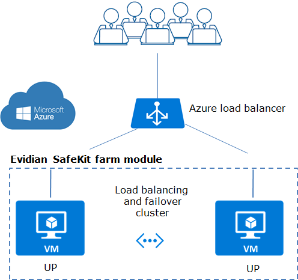

# Evidian SafeKit - Load Balancing Cluster with Failover in Azure - Farm Module

*   [Architecture](#archi)
*   [Installation](#install)

## Architecture

On the previous figure,

*   the critical application is running in all servers of the farm
*   users are connected to a virtual IP address which is configured in the Azure load balancer
*   SafeKit brings a generic health probe for the load balancer When the farm module is stopped in a server, the health probe returns NOK to the load balancer which stops the load balancing of requests to the server. The same behavior happens when there is a **hardware failure**
*   in each server, SafeKit monitors the critical application with process checkers and custom checkers
*   SafeKit restarts automatically the critical application in a server when there is a **software failure** thanks to restart scripts
*   a connector for the SafeKit web console is installed in each server. Thus, the load balancing cluster can be managed in a very simple way to avoid **human errors**

More information on **Evidian SafeKit**:

*   [Azure: The Simplest Load Balancing Cluster with Failover](https://www.evidian.com/products/high-availability-software-for-application-clustering/azure-load-balancing-cluster-failover/)
*   [Azure: The Simplest High Availability Cluster with Synchronous Replication and Failover](https://www.evidian.com/products/high-availability-software-for-application-clustering/azure-high-availability-cluster-synchronous-replication-failover/)

## A single click to install the high availability cluster

To deploy the Evidian SafeKit load balancing cluster with failover in Azure, just click on the following button which deploys everything:

### Configure the Azure template

After the click:

*   in "Resource group", click on "Create new" and set a name
*   choose the geographical "Location" where the cluster will be deployed
*   choose the "OS" Windows or Linux
*   choose the number of "Cluster Nodes"
*   choose an "Admin User" name (not Administrator)
*   choose an "Admin Password". Passwords must be between 12 and 72 characters and have 3 of the following: 1 lower case, 1 upper case, 1 number, and 1 special character.
*   click on "I agree..." and then on "Purchase" (no fee on SafeKit free trial, only on Azure infrastructure)
*   wait the end of deployment of the load balancing and failover cluster

### After deployment

After deployment, go to the output panel and

*   visit the credential url to get the client and CA certificates in your web browser
*   after certificates installation, start the web console of the cluster
*   test the load balanced virtual IP address with the test URL in the output. A load balancing rule has been set for external port 9453, internal port 9453
